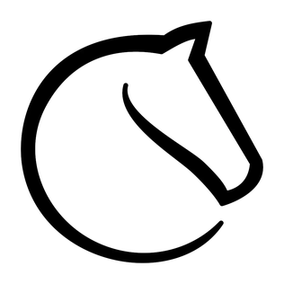

# L'argent

<!-- .slide: class="page-title" -->

## Lichess

Le site web comme atout
 
 
 

## Tidepool

Subventions
 
 
 
 

## Elastic Search

Support / Expertise

## MongoDB

Services annexes: Hébergement spécialisé

 
 
 

## Serenity OS

Support de la communauté, mécènes

<!-- .element: style="height: 70%;" -->

## Evolution des business models

- Démocratisation des micro-paiements
    - Emoticônes sur Twitch, Discord
    - Abonnement à un créateur sur Twitch, Youtube
    - Trophées sur Reddit
- Culture du mécenat
    - Patreon, subscribestar...
    - OpenCollective
    - Github Sponsors
    - Concept de récompenses
- Vente de l'expertise: Tidelift

## Economiser de l'argent

- Maintenance spontanée
- Contributions
- Détection de problèmes
